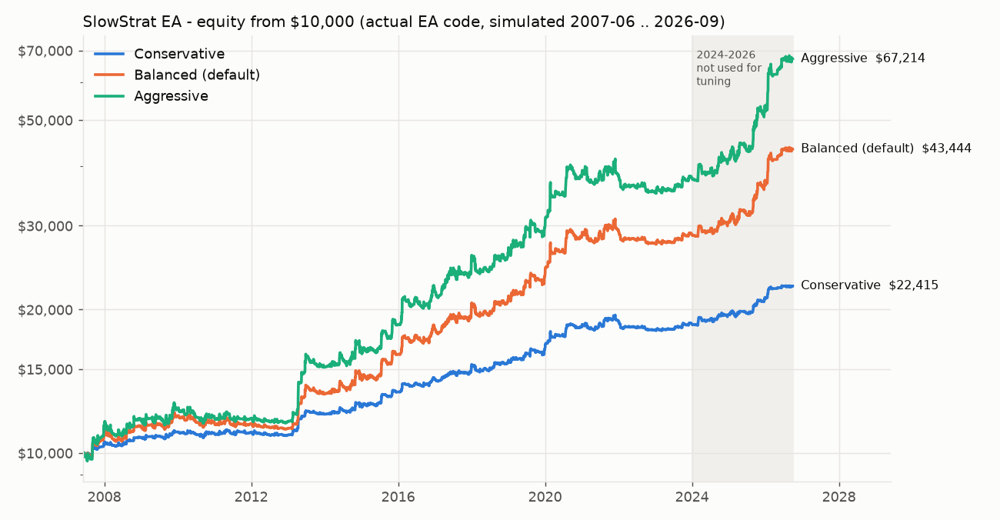
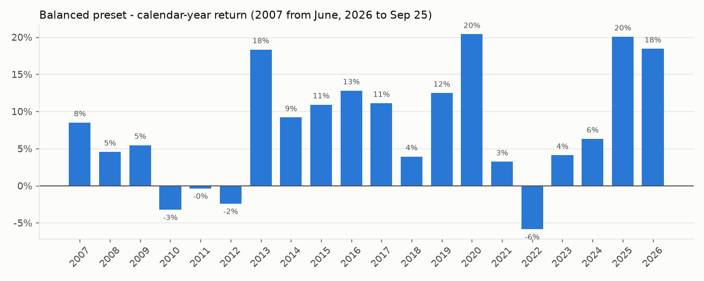
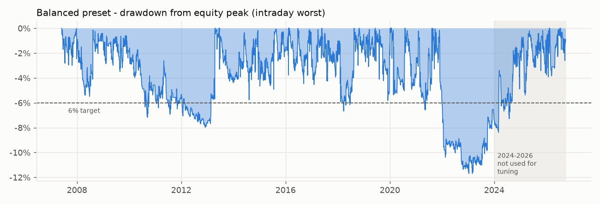

# SlowStrat — MT5 portfolio Expert Advisor

**Gold trend breakout + gold Asian‑range breakout + US‑index dip buyer, with risk‑based sizing, a drawdown brake, news filter and rollover/spread protection.**

`mql5/Experts/SlowStrat/SlowStrat.mq5` is the EA. Everything in `research/` and `tools/` is the evidence behind it and can be re‑run.

> **Read this first — honest summary**
>
> The goal was **15–20 % per year with less than 6 % maximum drawdown**, taking mostly high‑probability trades, built for *today's* market.
>
> | | Annual return | Max drawdown |
> |---|---|---|
> | **Today's market — Jan 2024 → Sep 2026** (never used to design or tune anything) | **+16.3 %/yr** | **5.4 %** |
> | 2025 | +20.2 % | 5.4 % |
> | 2026 to 25 Sep | +18.4 % (26.7 % annualised) | 3.9 % |
> | **Full history — Jun 2007 → Sep 2026** | **+7.9 %/yr** | **11.7 %** |
>
> Default *Balanced* preset, **actual EA code** run on historical data with spreads, commission, slippage and swaps (see [How it was tested](#how-it-was-tested)).
>
> **In the current market regime the EA meets the target. Over the full 19 years it does not.** It had flat or losing stretches:
> - **Losing years:** 2010–2012 and 2022, worst −5.8 %.
> - **Worst drawdown:** 11.7 %, during 2022.
> - **Longest time without a new equity high:** about 2.9 years (Nov 2021 → Oct 2024).
>
> I tested many dozens of strategy families on gold, silver, 18 FX pairs and 5 stock indices. None of them delivers 15–20 % with under 6 % drawdown *robustly* across 20 years. Backtests that claim so are almost always overfitted, or use martingale/grid position sizing that eventually blows up. This EA does neither. **Nothing here is a guarantee — use a demo account first.**



---

## Contents
1. [What the EA trades](#what-the-ea-trades)
2. [Results](#results)
3. [How it was tested](#how-it-was-tested)
4. [What did NOT work](#what-did-not-work-and-was-rejected)
5. [Installation and settings](#installation-and-settings)
6. [Important factors and risk notices](#important-factors-and-risk-notices)
7. [Verify it yourself in the MT5 Strategy Tester](#verify-it-yourself-in-the-mt5-strategy-tester)
8. [Reproduce the research](#reproduce-the-research)
9. [Limitations](#limitations)

---

## What the EA trades

The EA runs three independent modules on one chart. Each module has its own magic number. The bars are MT5 broker bars (server time).

| Module | Symbol | Timeframe | Win rate | Avg trade | Trades / yr | Role |
|---|---|---|---|---|---|---|
| **1. Gold trend breakout** | XAUUSD | H4 signals, M5 trailing | 33 % | **+0.49 R** | ~21 | Main profit engine; catches big gold trends. Few, large winners. |
| **2. Gold Asian‑range breakout** | XAUUSD | M5 | **71 %** | +0.04 R | ~70 | High win‑rate, small edge. Strong in 2024‑26 (74 % win, +0.14 R). |
| **3. US‑index dip buyer** | US500, NAS100, US30 | D1 | **71 %** | +0.15 R | ~14 (all 3) | High win‑rate, uncorrelated with gold (−0.1). |

All three modules together win **63 %** of their trades. (R = the amount risked on the trade; +0.49 R means the average trade made 49 % of what it risked.)

### Module 1 — Gold H4 trend breakout
- **Long:** the H4 close is above the highest high of the previous **80** H4 bars, **and** the last completed D1 close is above the **D1 SMA(200)**.
- **Short:** the mirror image.
- **Stop loss:** 1.0 × ATR(20, H4). No take‑profit.
- **Trailing stop:** 3 R behind the best price since entry. It is updated on every completed M5 bar and only ever moves in the trade's favour.
- One position at a time. A signal that arrives during the rollover window (16:30–18:30 New York time) is executed at 18:30 NY.

### Module 2 — Gold Asian‑range breakout (the high win‑rate module)
- **Asian range:** the high/low of 00:00–07:00 UTC.
- **Entry window:** 07:00–12:00 UTC. The **first** M5 close outside the range, in the direction of yesterday's close versus the **daily EMA(50)**, triggers the entry. There is at most one trade per day.
- The day is skipped if the range is smaller than 0.3 or larger than 2.0 × daily ATR(14).
- **Stop loss:** 1.0 × daily ATR(14). **Take‑profit:** 1.0 × the Asian range. That combination (wide stop, small target) is what produces the ~71 % win rate.
- Daily ATR and EMA use UTC days, which the EA builds itself from H1 data. This matches the research exactly (see the note in [Limitations](#limitations)).

### Module 3 — US‑index daily dip buyer
- **Buy** on the next session, after the daily rollover, when the completed D1 bar has:
  - **RSI(2) < 10**,
  - **IBS < 0.25**, where IBS (internal bar strength) = (close − low) / (high − low),
  - **close > SMA(200)**.
- **Exit:** at the first daily close above **SMA(5)**, or after 10 daily bars.
- **Stop loss:** 2 × ATR(10, D1).
- **Long only.** Each index is traded independently.

### Portfolio‑level protection (all modules)
- **Position sizing:** risk % of equity per trade, using `OrderCalcProfit`, so currency conversion is handled for any account currency. Commission is included in the sizing.
- **Drawdown brake:** full size until the drawdown from the equity peak reaches 3 %. From there, size shrinks linearly to 50 % at an 8 % drawdown.
- **Daily loss limit:** 3 %. No new entries for the rest of the server day.
- **Hard stop:** at 20 % drawdown the EA closes everything and halts until you reset it.
- **Open‑risk cap:** 5 % of equity across all open positions.
- **Rollover block:** no entries 16:30–18:30 New York time, when spreads explode.
- **Spread filter:** gold 4 bp, indices 3 bp of price.
- **News filter:** uses the MT5 economic calendar (live only). No new entries from 30 min before to 20 min after high‑impact USD events.
- All stops are **server‑side**, so a lost connection never leaves a position unprotected. Per‑position state survives restarts (stored in terminal global variables).
- Two on‑chart displays:
  - **Status panel:** equity, drawdown, brake level, open risk, server/UTC/NY clocks and the next three high‑impact news events.
  - **Trade log:** `MQL5/Files/SlowStrat_log.csv`.

---

## Results

Results come from the **actual EA source code** run on historical data through an MT5 emulator (details in [How it was tested](#how-it-was-tested)). Setup:
- **Start and period:** $10,000 start, Jun 2007 → 25 Sep 2026.
- **Costs:**
  - **Gold:** spread ≈ 0.8 bp of price with a $0.25 floor ($0.32 at $4,000), 5 × wider around rollover; commission $7 per lot round trip; slippage $0.08 per fill.
  - **Indices:** spread 0.7–1 bp; slippage 0.3 bp.
  - **Swaps (annual, on position value):** gold long −5.5 %, short −1 %; indices long −7 %, short −2 %.
- **Fills:** a stop that gaps fills at the (worse) open. If a stop and a target are both touched in the same bar, the stop is assumed to hit first.

**CAGR / maximum drawdown by period and preset.** Drawdown is the worst intraday point measured from the equity peak.

| Period | Conservative | **Balanced (default)** | Aggressive |
|---|---|---|---|
| 2008–2011 | 1.3 % / 3.5 % | 1.2 % / 7.2 % | 0.9 % / 9.7 % |
| 2012–2015 | 5.0 % / 3.1 % | 8.8 % / 5.8 % | 12.0 % / 8.5 % |
| 2016–2019 | 5.4 % / 3.8 % | 10.0 % / 6.7 % | 12.5 % / 8.8 % |
| 2020–2023 | 2.8 % / 7.5 % | 4.8 % / 11.7 % | 5.8 % / 15.6 % |
| **2024 → Sep 2026 (holdout)** | **7.0 % / 3.0 %** | **16.3 % / 5.4 %** | **23.5 % / 6.9 %** |
| 2025 | 8.0 % / 3.0 % | 20.2 % / 5.4 % | 26.5 % / 6.9 % |
| 2026 YTD (annualised) | 8.9 % / 1.4 % | 26.7 % / 3.9 % | 41.1 % / 5.7 % |
| **Full 2007–2026** | **4.3 % / 7.5 %** | **7.9 % / 11.7 %** | **10.4 % / 15.7 %** |
| $10k grew to | $22,415 | $43,444 | $67,214 |

Risk per trade for each preset:

| Preset | Gold trend | Gold Asia | Each index |
|---|---|---|---|
| Conservative | 0.30 % | 0.25 % | 0.50 % |
| Balanced | 0.60 % | 0.50 % | 1.00 % |
| Aggressive | 0.90 % | 0.75 % | 1.50 % |

Index data only starts in May 2013, so 2007–2012 is gold‑only.




**What to expect over the next 12 months (Balanced).** These come from a block‑bootstrap Monte Carlo of the EA's monthly returns, 20,000 paths:

| If the market behaves like… | Median 12‑m return | 5 % worst case | Chance of a losing year | Chance of ≥ 15 % |
|---|---|---|---|---|
| 2024–2026 | +16.8 % | +3.2 % | 1.2 % | 56 % |
| the whole 2007–2026 history | +7.2 % | −3.3 % | 14.7 % | 20 % |

Across the real 2007–2026 path, rolling 12‑month returns ranged from −9.1 % to +37.7 % (median +6.5 %), and 81 % of them were positive.

Full per‑period tables, yearly returns and every simulated trade are in [`results/ea_simulation/`](results/ea_simulation/).

---

## How it was tested

1. **Data (all public).** The usual market‑data sites were blocked from the build environment, so everything was assembled from public GitHub datasets (sources in [`research/fetch_data.sh`](research/fetch_data.sh)):
   - **XAUUSD M5 2004 → 27 Sep 2026:** Dukascopy from 2020, an OctaFX MT4 feed before that. The feeds were cross‑checked and time‑aligned (correlation 0.99+).
   - **H1 bars for 18 FX pairs, 5 indices and silver:** 2007/2013 → Sep 2023.
   - **Recent data:** M1 samples for Mar → Sep 2026, and index daily bars for May 2024 → Sep 2026.
2. **A realistic Python backtest engine** ([`research/engine.py`](research/engine.py)):
   - M5 execution with bid/ask spreads, extra spread at rollover, commission, slippage and swaps, including triple Wednesday swaps.
   - Gap fills at the open, and "stop hits first" when a bar touches both stop and target.
   - Worst‑intraday mark‑to‑market drawdown.
   - Broker‑style H4/D1 bars on New‑York‑close server time.
   - Signals only from completed bars, so there is no look‑ahead.
3. **Development versus holdout.** Strategy families and parameters were chosen on **2012–2023**, which covers bear, flat and choppy gold markets. They had to be positive in each of 2012‑15, 2016‑19 and 2020‑23, not just on average. **Jan 2024 → Sep 2026 was never used for any decision.** The one exception is the Asia module: it was kept after I saw it was fragile, and it runs at small risk.
4. **Robustness checks on the actual EA.** Every check below ran the real EA code in the emulator:
   - **Parameter sensitivity:** 23 variants, each nudging one parameter by ±20–25 % (channel 60/100, stop 0.8/1.25 ATR, trail 2.5/3.5 R, SMA 150/250, RSI 7/15, IBS 0.2/0.3, …). All land at **6.7–8.3 %/yr with 10–13 % DD over the full history, and 13.7–18.6 %/yr with 4.5–6.1 % DD in 2024‑26.** That is a plateau, not a lucky peak.
   - **Costs:** doubled spreads → 14.0 %/yr (DD 5.7 %) in 2024‑26 and 4.6 %/yr over the full history. Tripled slippage → 14.7 %/yr (DD 5.9 %) in 2024‑26. Both together → 11.3 %/yr (DD 4.8 %) in 2024‑26.
   - **Broker time zone:** on a plain GMT+0 server (different daily and H4 bars) it still earns 16.5 %/yr with 5.0 % DD in 2024‑26, but only 5.7 %/yr over the full history. New‑York‑close brokers (GMT+2 winter / GMT+3 summer) are recommended.
   - **Account size:** below about $5,000, the 0.01‑lot minimum on gold makes the EA skip trades. $2,500 still works at reduced frequency; $1,000 mostly does not.
   - **Crashes and gaps:**
     - The worst single trade was **−1.47 R**, a weekend gap. Only 5 of 2,023 trades lost more than 1.2 R.
     - The worst day was −3.0 %.
     - The 2008 crisis, the April 2013 gold crash, the March 2020 COVID crash, the 2022 rate shock and the 2025‑26 gold spike are all inside the test.
   - **Losing streaks:** 9 in a row for gold trend, 6 for gold Asia, 7 for index dips.
5. **EA‑versus‑research parity check.** No MT5 terminal could be downloaded here, so I wrote an MT5 emulator ([`tools/mt5sim`](tools/mt5sim)):
   - [`mql2cpp.py`](tools/mt5sim/mql2cpp.py) mechanically translates `SlowStrat.mq5` to C++.
   - [`mql5rt.h`](tools/mt5sim/mql5rt.h) is a runtime that implements the MQL5 API used by the EA.
   - The translated EA **compiles with zero errors and zero warnings under `g++ -Wall`**.
   - Run over 2007–2026, the EA reproduces the research trades:

     | Module | Research trades matched | Same direction | Same exit | R correlation |
     |---|---|---|---|---|
     | Gold trend | 397 of 398 | 100 % | 99.7 % | 0.994 |
     | Gold Asia | 1,361 of 1,362 | 100 % | 100 % | 1.000 |
     | Index dips | all | 100 % | 96–100 % | 0.994–0.999 |

   - The few extra EA trades come from indicator warm‑up that the research skipped conservatively.

## What did NOT work (and was rejected)
- **Short‑term mean reversion on gold** (RSI‑2 dips on M15/H1/H4, Bollinger fades, previous‑day‑high/low sweep reversals): no edge after costs. Costs are about 0.1 R per trade on H1.
- **Trend following on FX, silver and non‑US indices:** negative in 2016–2023 in almost every configuration.
- **Mean reversion on FX crosses** (EURGBP, AUDCAD, …): the best was only about +0.03 R per trade.
- **The "gold rises every night" effect:** it is a *data artefact*. Bid prices dip when spreads widen at 17:00 NY and recover at the reopen. It is not tradeable.
- **Pyramiding, partial take‑profit, and ADX / efficiency / volatility‑compression filters on the gold breakout:** each one made the robust results worse.
- **Martingale, grid and averaging down:** deliberately not used. They produce beautiful backtests and eventually wipe out accounts.

---

## Installation and settings

1. **Copy the EA.** Put `mql5/Experts/SlowStrat/SlowStrat.mq5` into your terminal's `MQL5/Experts/SlowStrat/` folder (File → Open Data Folder).
2. **Compile it.** Open it in MetaEditor and press F7.
3. **Attach it** to **any one chart**, for example XAUUSD M5. It trades all its symbols from that one chart. Turn on *Algo Trading*.
4. **Account.** Use a **hedging** account; the two gold modules need separate positions. On a netting account they share one XAUUSD slot.
5. **Symbols.** The EA auto‑detects `XAUUSD`/`GOLD` and `US500`/`SPX500`/`US500Cash`, `NAS100`/`USTEC`/`US100`, `US30`/`DJ30`/`WS30`, including suffixes such as `.r` or `m`. If your broker uses other names, set `InpGoldSymbol` and `InpIndexSymbols` (for example `US500.cash,USTEC.cash,US30.cash`). Show them in Market Watch.
6. **Broker time.** Leave `InpServerGMTOffsetWinter = 2` and `InpServerUsesUSDST = true` for most brokers (GMT+2/+3). In live trading the offset is detected automatically. In the **Strategy Tester** it must be set correctly for your broker's server.
7. **Commission.** Set `InpGoldCommissionPerLot` to your broker's gold round‑trip commission per lot (the default is 7.0). On a raw‑spread account with $3 per side, enter 6.0. On a commission‑free account, enter 0.
8. **VPS.** Run the EA 24/5 on a VPS close to your broker's server.

| Key input | Default | Meaning |
|---|---|---|
| `InpPreset` | Balanced | Conservative / Balanced / Aggressive / Custom |
| `InpRiskMultiplier` | 1.0 | Scales every module's risk. For example, Balanced × 0.5 ≈ Conservative. |
| `InpDDBrake*` | 3 % → 8 %, floor 0.5 | Risk reduction while in drawdown |
| `InpDailyLossLimitPct` | 3 | Pause new entries for the day |
| `InpHardStopDDPct` | 20 | Close all positions and halt. Resume with `InpResetPeakOnStart=true`. |
| `InpMaxOpenRiskPct` | 5 | Cap on the sum of initial risk across open trades |
| `InpNewsBeforeMin` / `After` | 30 / 20 | High‑impact news blackout for new entries |
| `InpGoldTrendEnable` / `InpGoldAsiaEnable` / `InpIndexEnable` | true | Switch modules on or off |

**Choosing a preset:**
- **Your target (≈15–20 %/yr, <6 % DD in the current market):** Balanced.
- **Drawdown that stayed under 6 % in almost every period:** Conservative. It has lower returns, about 4–9 %/yr.
- **Aggressive:** roughly doubles returns in strong regimes, and drawdowns reached 15.7 % historically.

**Minimum balance:** about **$5,000**. Also check your broker's minimum lot size for indices: if it is 0.1 lot at $1/point, you need more.

---

## Important factors and risk notices

- **Regime dependence (the biggest risk).** Most of the profit comes from gold trends.
  - When gold trends, as in 2013 (down), 2019‑20 and 2024‑26, the EA does well.
  - When gold chops sideways for years, as in 2010‑12 and 2021‑23, it goes flat or loses up to ~12 % (Balanced) and can take **2–3 years** to recover.
  - The index dips help, but they cannot fully offset a bad gold regime.
- **High‑impact news.** The MT5 calendar filter blocks new entries around USD events: NFP, CPI, FOMC, GDP, retail sales, PCE, ISM.
  - It is **live‑only**. The MT5 Strategy Tester has no calendar, so tester results do not include it.
  - The strategy's entry times (H4 bar closes and 07:00–12:00 UTC) rarely coincide with releases, so the effect is small.
  - Open positions are *not* closed before news. Their stops are server‑side, and a news spike can still gap through a stop (worst case in 19 years: −1.47 R).
  - Consider switching the EA off for truly exceptional events such as elections or central‑bank emergency meetings.
- **Rollover (17:00 New York).** Spreads widen 5–20× for about an hour. The EA never *opens* trades 16:30–18:30 NY, but an existing stop can be hit by the spread spike. Choose a broker with sane rollover spreads.
- **Weekend gaps.** Gold and index positions are held over weekends, because the trend module needs to. A Monday gap past the stop fills at the gap price.
- **Swaps.** Gold longs pay about 5–6 %/yr and index longs about 7 %/yr of position value per night held. These costs are included in the results. Swap‑free (Islamic) accounts with admin fees change the numbers.
- **Broker differences.** Spreads, commissions, contract sizes, minimum lots, server time zone and data feed all differ between brokers. Results *will* differ from these tests; always run your own tester check (see below).
- **Leverage and margin.** At the default settings gross exposure is modest: a median of 0.3× equity while in trades, 1.6× at the 95th percentile and 3.8× at the historical peak (several modules in trades at once). Leverage of 1:20 or more is plenty.
- **Prop‑firm rules.** The daily loss limit (3 %) and the brake are compatible with typical 5 %‑daily / 10 %‑total rules, but check the firm's rules on news trading and weekend holding.
- **Correlation.** The three index dips often trigger on the same day (correlation 0.3–0.7). That is why each is sized independently and the open‑risk cap exists.
- **Past performance does not guarantee future results.** Even out‑of‑sample, 2024‑26 is only 2.7 years, and it was an exceptional gold bull market.

---

## Verify it yourself in the MT5 Strategy Tester
1. Open the Strategy Tester (Ctrl+R) and pick Expert `SlowStrat\SlowStrat`.
2. Choose XAUUSD, any timeframe (M5 is fine), **"1 minute OHLC"** or **"Every tick based on real ticks"**.
3. Set the dates, for example 2015‑01‑01 → today, and a $10,000 deposit.
4. Make sure your broker provides history for XAUUSD **and** your index symbols. The tester downloads the other symbols automatically when the EA requests them.
5. Set `InpServerGMTOffsetWinter` / `InpServerUsesUSDST` for your broker's server.
6. Compare with the tables above for the same years. Expect differences from your broker's spreads and data, but the same general shape.
7. `OnTester()` returns return ÷ max drawdown, so "Custom max" optimisation works. Don't over‑optimise: the defaults were deliberately chosen from the middle of a plateau.

## Reproduce the research
```bash
pip install numba pandas numpy pyarrow scipy matplotlib
bash research/fetch_data.sh                 # public data -> /home/user/data_repos (set DATA_REPOS to change)
cd research
python3 run_gold_trend.py                    # gold breakout parameter sweep (dev vs holdout)
python3 final_portfolio.py && python3 stress.py   # portfolio, cost stress, drawdown brake, Monte Carlo
cd ../tools/mt5sim
./run_ea_backtest.sh                         # translate + compile + run the ACTUAL EA over 2007-2026
./run_ea_backtest.sh InpPreset=2 --spread_mult=2   # any input / stress
python3 parity.py /tmp/ea_run                # EA-vs-research trade parity (needs final_portfolio.py run first)
```

## Limitations
- **The EA has not been run inside MetaTrader 5 itself.** The build environment could not reach mql5.com. Its logic was compiled and executed through a faithful C++ translation and emulator, and it matched the research trade‑for‑trade. **Still compile it in MetaEditor and run the Strategy Tester on your broker before going live.**
- **Data gaps:** FX and index intraday data are missing from Sep 2023 to Mar 2026 (index daily data exists from May 2024). Index history starts in 2013. Gold data is complete from 2004 to 27 Sep 2026.
- **Price data is bid‑only** (Dukascopy/OctaFX). Spreads are modelled, not observed.
- **The Asia module is regime‑dependent.** Its long‑run edge is small (+0.04 R), it was strong in 2024‑26 (+0.14 R), and it weakens if daily bars are cut at broker midnight instead of UTC midnight. That is why it runs at a small risk and can be disabled (`InpGoldAsiaEnable=false`). Without it, Balanced makes 11.1 %/yr (DD 4.8 %) in 2024‑26 and 6.8 %/yr (DD 12.1 %) over the full history, against 16.3 % / 5.4 % and 7.9 % / 11.7 % with it.

**Disclaimer:** This is research software, not financial advice. Trading leveraged products carries a high risk of loss, including more than your deposit with some brokers. Only trade money you can afford to lose.
